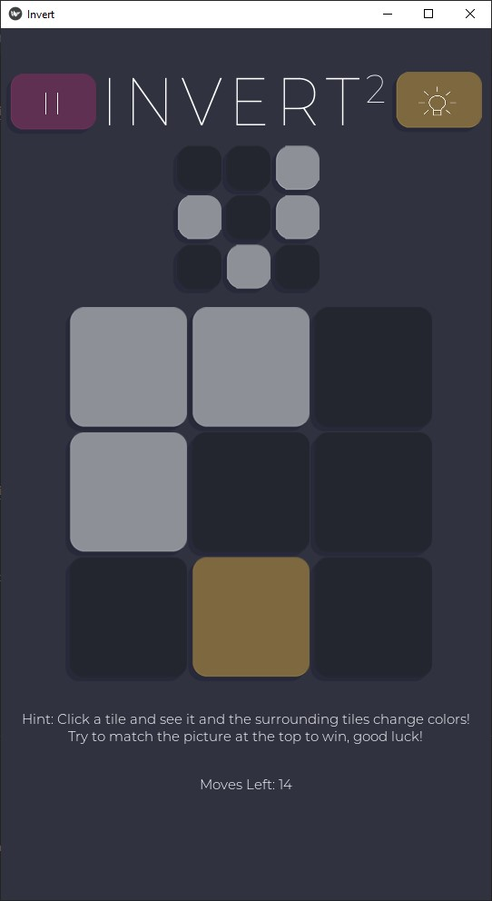

# invertsquared

This is a python3.8 project that is being made for CIS4930: Performant Programming in Python.

PROJECT DESCRIPTION
-    
An up and coming puzzle game that is simple and concept but difficult to solve! Try to replicate the image that is shown to you by touching the tiles on the grid; however there is a twist. When a tile is touched, the surrounding tiles (minus the ones in the diagonal directions) are also flipped! Try to figure out the best set of moves to solve the puzzle.

AESTHETICS:
Color scheme and gameplay layout:
Muted colors, flat design; minimalist

- Image to be replicated in top right corner; rounded edges for softer, embedded look
- Game grid will be a 3x3 grid of tiles.

SCREENS:
- Home screen: logo in the center (letters are colored, bg is grey); beneath logo: settings/menu, play, share icons;
- Settings screen: game mode (dark/light) (maybe?? or we just stick with the dark theme); audio/vibration settings (if applicable); credits
- Pause screen: home button; settings button; restart level button; select level button;
- Share screen: copy app link for play store; share to Twitter, FB, etc.;
- More screen: 1. Rate the app; 2. Mail feedback; 3. About the project (a link to the git repository)
- Level selection screen: 1. choose between Classic, Challenge, Expert (horizontal bars, rounded edges in the center of screen); 2. Select level (level mode will be at top centered; levels will be sorted by difficult ie. lvl 1 is easiest, 9 is hardest; random level buttton also available); home button in upper portion of level select screen;
- Win screen: 1. Restart the level to try for a higher score; 2. Return to the Home screen; 3. Go on to the next level
- Lose screen: 1. Restart the level; 2. Return to the Home screen

GAMEPLAY:
- 9 levels each mode; plus infinite number of randomly generated levels (which are all guaranteed to be solvable) 
  - 3 Difficulty Modes: Classic, Challenge, Expert
- Classic Mode: image to be replicated in upper portion of screen; playing with no time limits or move limits; STRATEGY-BASED gameplay
- Challenge Mode: image to be replicated in upper portion of screen; playing within a given amount of moves; STRATEGY-BASED gameplay
- Expert Mode: image will be shown before you begin the level, but will not remain on screen; MEMORY-BASED gameplay; NO HINTS ALLOWED
  - play within a given amount of moves AND given amount of time
- Hints: When stuck, hints are provided by the lightbulb button in the top-right corner in Classic and Challenge mode, BUT will lower your star score
- Stars: based on the amount of moves that you make (and the amount of hints you use), you will be given a star score on completion of each level

**Run the following commands in the project directory:**

For Windows use:
`pip install -r windows.txt`

Otherwise (such as Ubuntu 20.04), use:
`pip install -r requirements.txt`

Executable Command
-

`python3 Scripts\invert.py`

Link to Repository
-

https://github.com/JAlexHouse/invertsquared

AUTHORS:

Nicole Liang

James Boultinghouse

Melinda Chhu

Nancy Chen

Christopher In

## Audio Assets Used

https://freesound.org/people/GameAudio/sounds/220212/ 

https://freesound.org/people/MattLeschuck/sounds/511484/

https://freesound.org/people/Leszek_Szary/sounds/173958/ 

https://freesound.org/people/OrangeMcMuffin/sounds/422538/  
